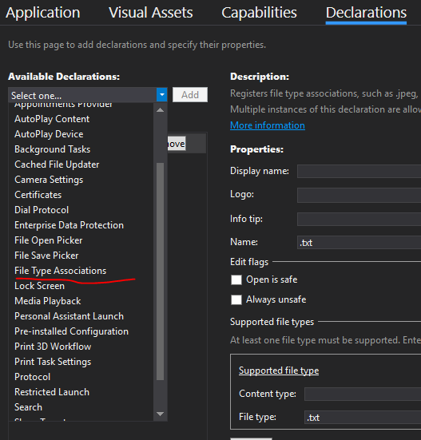
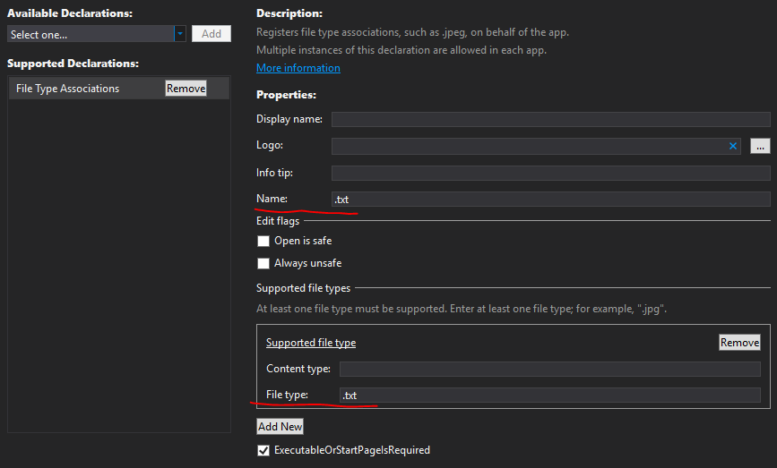
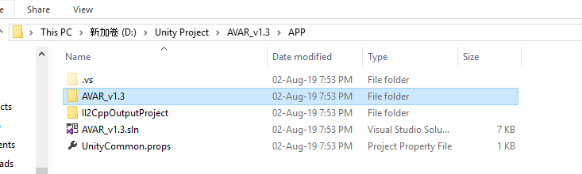
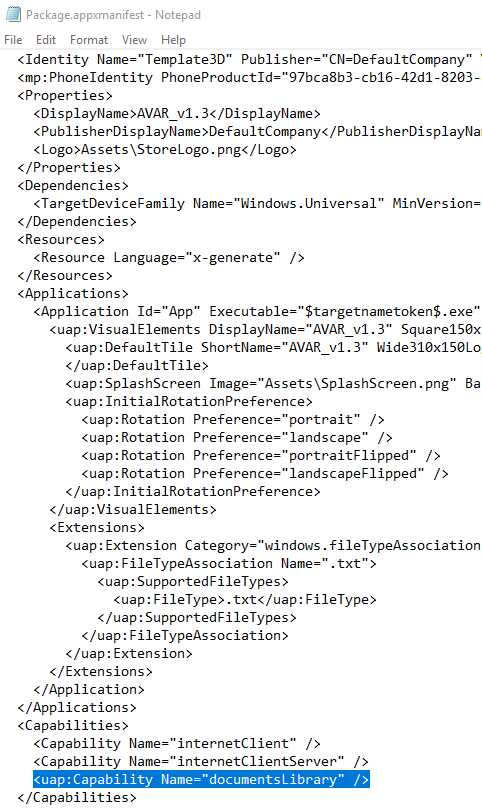
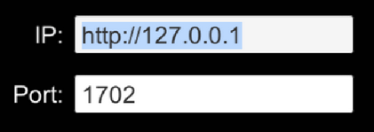
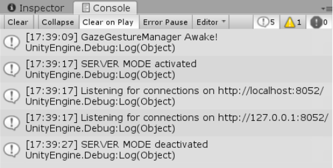

# AVAR: Agile Visualizations in Immersive Augmented Reality

## Contents
1. [Install Unity and Visual Studio for Mixed Reality Development](#1-install-unity-and-visual-studio-for-mixed-reality-development)
2. [Install Woden on Pharo 8.0](#2-install-woden-on-pharo-80)
3. [Running AVAR](#3-running-avar)
4. [Running Server Mode](#4-running-server-mode)
5. [User interactions](#5-user-interactions)


---

## How to Install AVAR
### 1. Install Unity and Visual Studio for Mixed Reality Development
**1.1. Install Mixed Reality Tools**

Follow the next Microsoft manual: [https://docs.microsoft.com/en-us/windows/mixed-reality/install-the-tools](https://docs.microsoft.com/en-us/windows/mixed-reality/install-the-tools). 

Note: We used Unity (v 2018.3.11f1), Microsoft Visual Studio Community 2017 (Version 15.9.10), and Microsoft .NET Framework (Version 4.7.03190).

**1.2. Download AVAR project**

Clone or download this project

```
$ git clone https://github.com/bsotomayor92/AVAR-unity.git
```

Note: Over this folder you will have both Unity and Visual Studio projects.

**1.3. Open you the project on Visual Studio**

* Visual Studio will find individual components which should be on the project. If not, they will be installed. This operation may require your computer to restart.

* Once you open Visual Studio for the first time it will generate source files and build the project.

**1.4. Open your the project on Unity**

Open Unity, click on "Open a project folder" and select the folder downloaded from GitHub ("AVAR-unity").

On Unity, click on "Edit" tab, and select "Project Settings". Then, select tab "Tags and Layers" and add/type the next tags:
+ WodenObj
+ Roassal2Obj
+ Edge

**1.5. Change the settings and then build the Unity project**

(1) In Unity, File==>Build Settings： Change the platform to Universal Windows Platform (UWP) and activate VR support.

(2) In Unity, File==>Build Settings==>Player Settings==>Publish Settings： Activate "InternetClient" and "InternetClientServer".

(3) Build the project.

**1.6. Implement this Unity project to HoloLens**

(1a) Open the .sln document, then open the Solution Explorer, and then open "Package.appxmanifest" on the path of the project.


(1b) Choose "Declarations" tab, and then add "File Type Associations"



(1c) add ".txt" in "name" and in "file type"，save it by Ctrl+S , now your project can interact with .txt document.


  
(2a) Open the folder sharing the same name with your .sln document



(2b) Open "Package.appxmanifest" with Notepad.

(2c) Find "<Capabilities>" and add "<uap:Capability Name="documentsLibrary" />"  between it and "</Capabilities>".



(2d) Save by Ctrl+S, now your project can interact with the default Document folder in Hololens(Or Pc-UWP)

(3) Deploy to mixed reality device following the example: [https://docs.microsoft.com/zh-cn//windows/mixed-reality/holograms-100](https://docs.microsoft.com/zh-cn//windows/mixed-reality/holograms-100)

<br/>

---

            
### 2. Install Woden on Pharo 8.0

**2.1. Installing Pharo Launcher**

Go to [https://pharo.org/download](https://pharo.org/download). Select your OS and download that version of Pharo Roassal. You can follow the installation documentation for each OS distribution.

**2.2. Create an empty Virtual Machine**

Create a virtual machine (VM) using Pharo Launcher by selecting Pharo 8.0 - 64bit (stable).

**2.3. Download Woden**

Open a Playground window (<kbd>Ctrl</kbd>+<kbd>O</kbd>+<kbd>W</kbd>) and type the next:

```
Metacello new
   baseline: 'WodenEngine';
   repository: 'github://woden-engine/woden/tonel';
   load
```

Then, execute the script by pressing <kbd>Ctrl</kbd>+<kbd>D</kbd> ("DoIt"). This will download Woden Engine from the github repository.

**2.4. Download Roassal2**

Open a Playground window (<kbd>Ctrl</kbd>+<kbd>O</kbd>+<kbd>W</kbd>) and type the next:

```
Metacello new
    baseline: 'Roassal2';
    repository: 'github://ObjectProfile/Roassal2/src';
    load.
```

Then, execute the script by pressing <kbd>Ctrl</kbd>+<kbd>D</kbd> ("DoIt"). This will download Roassal2 Engine from the github repository.

Alternatively, you can install Roassal2 via Pharo Catalog Browser.

**2.5. Download AVAR changes**

1. Open Monticello Browser by pressing <kbd>Ctrl</kbd>+<kbd>O</kbd>+<kbd>B</kbd>.
2. On the next input field, search "WodenEngine-Roassal" and select it.
3. Click on "+Repository" button.

    1. Select "smalltalkhub.com" option and complete as follows:
    
        ```
        MCSmalltalkhubRepository
            owner: 'Boris'
            project: 'AVAR_test'
        ```
    
    2. Select "WodenEngine-Roassal" on the Right Panel and click on "Load" button. This will activate a procedure which overwrite archives.


**2.6. Testing**

In order to verify if both repositories have been correctly installed copy the next example and paste it over a Pharo playground panel:

```smalltalk
v := RWView new.
els:= RWCylinder new color: Color blue; elementsOn: (1 to: 2).
v addAll: els.
RWXZGridLayout on: els.
v run.
```

Next, select all the code and press <kbd>Ctrl</kbd>+<kbd>P</kbd> ("Print"). This will show a JSON representation of the view and its elements. In this case, the JSON corresponds to:

```json
{
    "elements":[
        {
            "position":[0.0,0.0,5.0],
            "type":"camera"
                },{
                "shape":{
                    "color":[0.0,0.0,1.0,1.0],
                    "shapeDescription":"mainCamera",
                    "extent":[1.0,1.0,1.0]
                },
            "position":[1.0,0.0,0.0],
            "type":"element"
        },{
            "shape":{
                "color":[0.0,0.0,1.0,1.0],
                "shapeDescription":"uvsphere",
                "extent":[1.0,1.0,1.0]
            },
            "position":[-1.0,0.0,0.0],
            "type":"element"
        },{
            "shape":{
                "color":[1.0,0.0,0.0,1.0],
                "shapeDescription":"cube",
                "extent":[1.0,1.0,1.0]
            },
            "position":[1.0,0.0,0.0],
            "type":"element"
        }
    ]
}
```

<br/>

---

### 3. Running AVAR

**3.1. Create a Pharo Service**
    
1. Open your Pharo Image, open a playground window, and then execute next code:

```smalltalk
(ZnServer startDefaultOn: 1702)
    onRequestRespond: [ :request |
        script := (request contents).
        ZnResponse ok: (ZnEntity text: (
            [[ZnReadEvalPrintDelegate evaluate: script. ]
            on: Error do:
            [:e | (NeoJSONWriter toString: (Dictionary newFromPairs: { #errormsg . ((Dictionary newFromPairs: { #message . e messageText asString })) })) ]]
            on: SyntaxErrorNotification do:
            [:ex | NeoJSONWriter toString: (Dictionary newFromPairs: { #errormsg . ((Dictionary newFromPairs: { #message . ex messageText asString. #location . ex location})) })]
            )). ].
```

This will create a Service which evaluates and sends responses to unity application on Hololens. This response contains geometrical description of each object created in Pharo Roassal and Woden Engine.

**3.2. IP Setting in the Unity App**
    
Press <kbd>Ctrl</kbd>+<kbd>N</kbd> in order to change the IP and Port and a new menu with IP Setting will appear: 



Then, set these parameters according to your configuration. If you are running Pharo and Unity on the same computer, then the IP corresponds to **https://127.0.0.1/**. In this example, the Port indicated was `1702`.

**3.3. Using HoloLens**
    
1. On Hololens:
    
    1. Install (if it is not yet) the "Holographic Remoting Player" from Microsoft web store ([link](https://www.microsoft.com/en-us/p/holographic-remoting-player/9nblggh4sv40?activetab=pivot:overviewtab)). Once installed, open it by tapping in the application icon.
    
    2. The app shows the Hololens IP. This will be necessary in order to connect Unity and the Hololens.

2. On Unity GUI:
    
    1. Click in "Holographic" Tab.
    
    2. Select "Remote to Device".
    
    3. Insert the Remote Machine IP indicated in "Holographic Remoting Player" and click on "Connect" button.

<br/>

---

### 4. Running Server Mode
It is possible to turn the AVAR application in Unity as Server. To enable this "Server mode", you have to press <kbd>Ctrl</kbd>+<kbd>W</kbd> when the Code Panel is visible. By doing this, the Debug Console in Unity will indicate the status of the server, the ports which it is listening to, and the JSON response which Pharo (client) sends to Unity (server).



Example:

In Pharo VM you need to execute the method “runOnServer:” followed by the url where the Unity application is located. Let’s create a view using Woden objects:

```smalltalk
v := RWView new.
    els:= RWCylinder new color: Color green; elementsOn: (1 to: 9).
    v addAll: els.
    RWXZGridLayout on: els.
    v runOnServer: 'http://127.0.0.1:8052'. 
```

After doing this, the Unity application will read a JSON from Pharo client and deploy all the elements into a new view in AVAR


<br/>

---

### 5. User interactions

**5.1. Keyboard shortcuts**

In addition to write code, AVAR app allows the possibility to do different operations for execution and interface option.

Current shortcut list :
* <kbd>ALT</kbd>: Hide/Show the Virtual Panel.
* <kbd>CTRL</kbd>+<kbd>D</kbd>: Evaluate the script and add as a new view/scene. It simulates the Pharo "Do it" execution.
* <kbd>CTRL</kbd>+<kbd>Shift</kbd>+<kbd>D</kbd>: Evaluate the script, erases all the previous views/scenes and adds the current one.
* <kbd>CTRL</kbd>+<kbd>E</kbd>: Open the example list. Use the same hotkey or “ESC” to turn it off.
* <kbd>CTRL</kbd>+<kbd>TAB</kbd>: Switch the main panel between code input panel and console panel.

**5.2. Gestures for interactions**

Currently, it is possible to select an object after targeting it with [Gaze](https://docs.microsoft.com/en-us/windows/mixed-reality/gaze) and doing an [Air Tap](https://docs.microsoft.com/en-us/windows/mixed-reality/gestures#air-tap). After selecting, the object will follow the camera. Then, do a Air Tap again for set the new position of the object.

More information about Hololens Gestures: [https://docs.microsoft.com/en-us/windows/mixed-reality/gestures](https://docs.microsoft.com/en-us/windows/mixed-reality/gestures).

---
